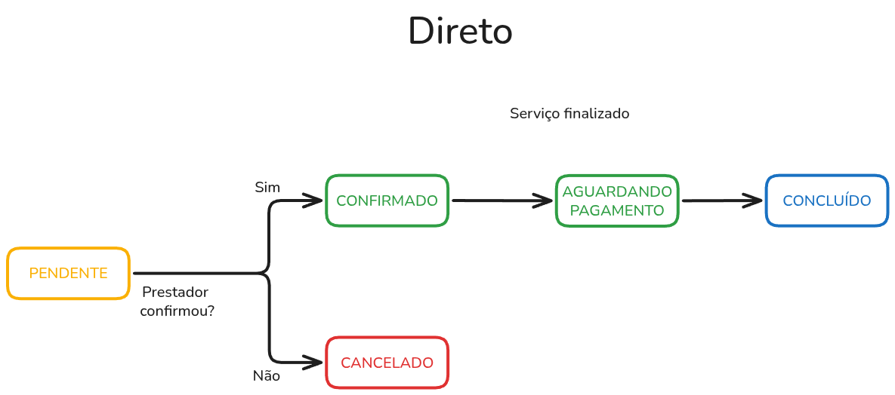
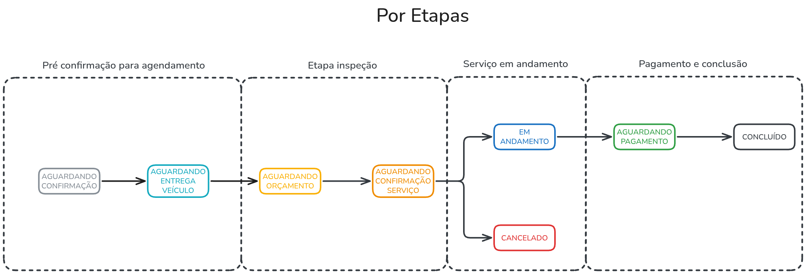

# Service Framework

O objetivo do serviceFramework é servir uma base sólida para desenvolver soluções baseadas em prestação de serviço.

## Pontos Fixos

- Criação de usuários (Clientes, Prestadores...)
- Avaliação de serviços prestados
- Envio de mensagens via chatbot

## Pontos Flexíveis

- Política de agendamento
- Precificação
- Serviço

## 1. Política de agendamento

A flexibilidade da política e fluxo de agendamento é um ponto flexível, pois o comportamento pode mudar de acordo com o cenário. Abaixo, temos alguns exemplos.

### Doméstico (Direto)

Agendamento simples, onde o cliente seleciona um serviço e escolhe um horário para ser feito.

### Automotivo (Por etapas)

O automotivo possui quatro etapas:

- **Pré confirmação**: O prestador deve confirmar que o agendamento é válido, e em seguida, fica no aguardo da entrega do veículo.
- **Definição de serviço**: É feito um agendamento entre cliente e prestador, onde o cliente fica no aguardo de uma avaliação de serviço que irá resolver o seu problema. Nesse momento, o prestador deve cadastrar o serviço com o que será feito, peças e custos. Após isso, o cliente deve confirmar o serviço.
- **Serviço em andamento**: Caso serviço seja confirmado, ele fica em andamento até o prestador finalizar o trabalho.
- **Pagamento e conclusão**: Finalização do serviço e cálculo do preço final, baseando-se em critérios como peças utilizadas e mão de obra.

### Psicólogo (Cíclico)

Nesse caso, temos um agendamento que é recorrente, e após cada sessão, automaticamente é cadastrada um novo agendamento, aguardando ao menos a confirmação 24h antes do agendamento. A frequência fica a cargo do cliente decidir (por exemplo, 2 vezes na semana, na segunda e quinta)

Também é possível agendar sessões extras, que podem ser feitas seguindo outro estilo de agendamento, como o direto

## 2. Precificação

## 3. Serviço prestado
